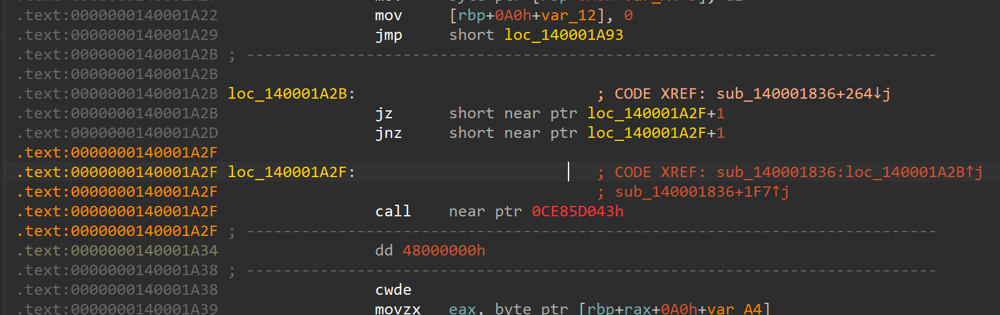

## Stretching - Writeup

### 0x1
Frist, when we run this program and see "Error opening file! Error code: "
, so we find string `Error opening file! Error code:` in ida:


and use x-refs to find where the program used this string 


```c
__int64 sub_140001836()
{
  __int64 v0; // rcx
  __int64 v1; // r8
  _DWORD v3[4]; // [rsp+20h] [rbp-60h] BYREF
  char v4; // [rsp+30h] [rbp-50h]
  char v5; // [rsp+31h] [rbp-4Fh]
  char v6; // [rsp+32h] [rbp-4Eh]
  char v7; // [rsp+33h] [rbp-4Dh]
  _QWORD Buf2[7]; // [rsp+40h] [rbp-40h] BYREF
  char v9; // [rsp+7Ch] [rbp-4h]
  char v10; // [rsp+7Dh] [rbp-3h]
  char v11; // [rsp+7Eh] [rbp-2h]
  char v12; // [rsp+7Fh] [rbp-1h]
  char Buffer[64]; // [rsp+80h] [rbp+0h] BYREF
  char v14[8]; // [rsp+C0h] [rbp+40h] BYREF
  unsigned __int64 v15; // [rsp+C8h] [rbp+48h]
  char v16; // [rsp+D0h] [rbp+50h]
  _BYTE Format[15]; // [rsp+DCh] [rbp+5Ch] BYREF
  _BYTE v18[13]; // [rsp+EBh] [rbp+6Bh] BYREF
  FILE *Stream; // [rsp+F8h] [rbp+78h]
  char *FileName; // [rsp+100h] [rbp+80h]
  unsigned __int8 j; // [rsp+10Bh] [rbp+8Bh]
  unsigned __int8 i; // [rsp+10Ch] [rbp+8Ch]
  char v23; // [rsp+10Eh] [rbp+8Eh]
  char v24; // [rsp+10Fh] [rbp+8Fh]

  sub_140001CC0();
  *v18 = 0xCABF8198B3E2979DuLL;
  *&v18[5] = 0x99869B90CABF81LL;
  *Format = 0x8DAA8E9B9DCCC29DuLL;
  *&Format[7] = 0xA7FF8A9F83D88DLL;
  *v14 = 0xD4AC99DE8ADAD89AuLL;
  v15 = 0xE5CCC8BA9F9F879EuLL;
  v16 = 0;
  sub_14000166D(v18);
  FileName = v18;
  Stream = fopen(v18, "r");
  if ( !Stream )
  {
    puts("Error opening file! Error code: ");
    exit(1);
  }
  memset(Buffer, 0, 0x31uLL);
  fgets(Buffer, 49, Stream);
  fclose(Stream);
  Buf2[0] = 0x8565D2ADB33A2D07uLL;
  Buf2[1] = 0xD4A4AC946233D52EuLL;
  Buf2[2] = 0x2412AD1C3B592793LL;
  Buf2[3] = 0x84CA0A89B2C53C5CuLL;
  Buf2[4] = 0xA776DE635107493LL;
  Buf2[5] = 0xABB663DC48002375uLL;
  v3[0] = -1302770076;
  v3[1] = 911739637;
  v3[2] = -1273139626;
  v3[3] = -1874285338;
  v4 = -71;
  v5 = 121;
  v6 = 55;
  v7 = -98;
  if ( sub_1400017F3(v0, 0xABB663DC48002375uLL, v1) )
  {
    v24 = 0;
    v9 = HIBYTE(v3[0]);
    v10 = BYTE2(v3[0]);
    v11 = BYTE1(v3[0]);
    v12 = v3[0];
    v23 = 0;
    JUMPOUT(0x140001A30LL); // <-- cant disassemble here
  }
  for ( i = 0; i <= 3u; ++i )
    sub_1400016ED(v3, i);
  for ( j = 0; j <= 0x2Fu; j += 8 )
    sub_140001450(v3, &Buffer[j]);
  if ( !memcmp(Buffer, Buf2, 0x29uLL) )
  {
    sub_14000166D(Format);
    sub_1400037F0(Format);
  }
  else
  {
    sub_14000166D(v14);
    sub_1400037F0(v14);
  }
  return 0LL;
}
```

jump to `0x140001a30`



some junk codes

patch it

and get this:

```c
__int64 sub_140001836()
{
  __int64 v0; // rcx
  __int64 v1; // r8
  __int64 v2; // rax
  char v3; // bl
  _DWORD v5[4]; // [rsp+20h] [rbp-60h] BYREF
  char v6; // [rsp+30h] [rbp-50h]
  char v7; // [rsp+31h] [rbp-4Fh]
  char v8; // [rsp+32h] [rbp-4Eh]
  char v9; // [rsp+33h] [rbp-4Dh]
  _QWORD Buf2[7]; // [rsp+40h] [rbp-40h] BYREF
  unsigned int v11; // [rsp+7Ch] [rbp-4h]
  char Buffer[64]; // [rsp+80h] [rbp+0h] BYREF
  char v13[8]; // [rsp+C0h] [rbp+40h] BYREF
  unsigned __int64 v14; // [rsp+C8h] [rbp+48h]
  char v15; // [rsp+D0h] [rbp+50h]
  _BYTE Format[15]; // [rsp+DCh] [rbp+5Ch] BYREF
  _BYTE v17[13]; // [rsp+EBh] [rbp+6Bh] BYREF
  FILE *Stream; // [rsp+F8h] [rbp+78h]
  char *FileName; // [rsp+100h] [rbp+80h]
  unsigned __int8 n; // [rsp+10Bh] [rbp+8Bh]
  unsigned __int8 m; // [rsp+10Ch] [rbp+8Ch]
  unsigned __int8 k; // [rsp+10Dh] [rbp+8Dh]
  unsigned __int8 j; // [rsp+10Eh] [rbp+8Eh]
  unsigned __int8 i; // [rsp+10Fh] [rbp+8Fh]

  sub_140001CC0();
  *v17 = 0xCABF8198B3E2979DuLL;
  *&v17[5] = 0x99869B90CABF81LL;
  *Format = 0x8DAA8E9B9DCCC29DuLL;
  *&Format[7] = 0xA7FF8A9F83D88DLL;
  *v13 = 0xD4AC99DE8ADAD89AuLL;
  v14 = 0xE5CCC8BA9F9F879EuLL;
  v15 = 0;
  sub_14000166D(v17);
  FileName = v17;
  Stream = fopen(v17, "r");
  if ( !Stream )
  {
    puts("Error opening file! Error code: ");
    exit(1);
  }
  memset(Buffer, 0, 0x31uLL);
  fgets(Buffer, 49, Stream);
  fclose(Stream);
  Buf2[0] = 0x8565D2ADB33A2D07uLL;
  Buf2[1] = 0xD4A4AC946233D52EuLL;
  Buf2[2] = 0x2412AD1C3B592793LL;
  Buf2[3] = 0x84CA0A89B2C53C5CuLL;
  Buf2[4] = 0xA776DE635107493LL;
  Buf2[5] = 0xABB663DC48002375uLL;
  v5[0] = -1302770076;
  v5[1] = 911739637;
  v5[2] = -1273139626;
  v5[3] = -1874285338;
  v6 = -71;
  v7 = 121;
  v8 = 55;
  v9 = -98;
  if ( sub_1400017F3(v0, 0xABB663DC48002375uLL, v1) )
  {
    for ( i = 0; i <= 3u; ++i )
    {
      LOBYTE(v11) = HIBYTE(v5[i]);
      BYTE1(v11) = BYTE2(v5[i]);
      BYTE2(v11) = BYTE1(v5[i]);
      v2 = v5[i];
      HIBYTE(v11) = v5[i];
      for ( j = 0; j <= 3u; ++j )
      {
        LODWORD(v2) = v2;
        v3 = Buffer[v2 - 4];
        Buffer[j - 4] = sub_140003C70(i * j + 1, i + j + 1) ^ v3;
        v2 = j + 1;
      }
      v5[i] = _byteswap_ulong(v11);
    }
    for ( k = 0; k <= 0x30u; k += 8 )
      sub_140001450(v5, &Buffer[k]);
    exit(1);
  }
  for ( m = 0; m <= 3u; ++m )
    sub_1400016ED(v5, m);
  for ( n = 0; n <= 0x2Fu; n += 8 )
    sub_140001450(v5, &Buffer[n]);
  if ( !memcmp(Buffer, Buf2, 0x29uLL) )
  {
    sub_14000166D(Format);
    sub_1400037F0(Format);
  }
  else
  {
    sub_14000166D(v13);
    sub_1400037F0(v13);
  }
  return 0LL;
}
```

and patch at `sub_1400017F3` and `sub_140001450`

```c
__int64 sub_1400017F3()
{
  return NtCurrentPeb()->BeingDebugged & 1;
}
```

```c
__int64 __fastcall sub_140001450(__int64 a1, __int64 a2)
{
  __int64 result; // rax
  unsigned int v3; // [rsp+Ch] [rbp-14h]
  int i; // [rsp+10h] [rbp-10h]
  unsigned int v5; // [rsp+14h] [rbp-Ch]
  unsigned int v6; // [rsp+18h] [rbp-8h]
  unsigned int v7; // [rsp+1Ch] [rbp-4h]

  v7 = _byteswap_ulong(*a2);
  v6 = _byteswap_ulong(*(a2 + 4));
  v3 = _byteswap_ulong(*(a1 + 16));
  v5 = 0;
  for ( i = 0; i <= 31; ++i )
  {
    v7 += (((v6 >> 5) ^ (16 * v6)) + v6) ^ (*(a1 + 4LL * (v5 & 3)) + v5);
    v5 += v3;
    v6 += v7 ^ (*(a1 + 4LL * v5) + v5);
  }
  *a2 = HIBYTE(v7);
  *(a2 + 1) = BYTE2(v7);
  *(a2 + 2) = BYTE1(v7);
  *(a2 + 3) = v7;
  *(a2 + 4) = HIBYTE(v6);
  *(a2 + 5) = BYTE2(v6);
  *(a2 + 6) = BYTE1(v6);
  result = a2 + 7;
  *(a2 + 7) = v6;
  return result;
}
```

- sub_14000166D (XOR Decryption Function)

  - Purpose: Performs cyclic XOR decryption using a 3-byte key (EF BE AD DE ED FE 06)
  - Behavior: Processes input buffer until NULL terminator is found
- sub_1400017F3 (Anti-Debug/Exception Handler)

  - Purpose: Accesses TEB structure with exception handling instructions
  - Likely use: Anti-debugging checks or code protection
- sub_1400016ED (Data Processing Function)

  - Purpose: Performs bit manipulation and endianness conversion
  - Operations: Circular right shifts each byte + byte swapping
- sub_140001450 (TEA Encryption Implementation)

  - Purpose: 32-round variant of Tiny Encryption Algorithm
  - Characteristics: Uses complex bit operations with key scheduling
- sub_140003C70 (Wrapper Function)

  - Purpose: Simple call-through to sub_140002D50

## 0x02 dynamic analysis

set a breakpoint at `0x7ff60d0818de Stream = fopen(v17, "r");` and see that is the value of v17


the read file path is `C:\\flag.txt`


```c
if ( sub_7FF7078417F3() )
  {
    for ( i = 0; i <= 3u; ++i )
    {
      LOBYTE(v9) = HIBYTE(v4[i]);
      BYTE1(v9) = BYTE2(v4[i]);
      BYTE2(v9) = BYTE1(v4[i]);
      HIBYTE(v9) = v4[i];
      for ( j = 0; j <= 3u; ++j )
      {
        v1 = Buffer[j - 4];
        sub_7FF707843C70();
        Buffer[j - 4] = a1 ^ v1;
      }
      v4[i] = _byteswap_ulong(v9);
    }
    for ( k = 0; k <= 0x30u; k += 8 )
      sub_7FF707841450();
    exit(1);
  }
```

if we use a debugger to attach the program then `sfub_7FF60D0817F3()` will be `True` and enter the if branch else call `sub_7FF7078416ED(v3, m)` then call `sub_7FF707841450()`, finally compare the value between `memcmp`and `Buf2`. So we need to patch the if-condition.

change `jz` into `jnz`

and sea breakpoint at `jz loc_7FF7A5591B33`

```c
for ( n = 0; n <= 0x2Fu; n += 8 )
    sub_7FF707841450(v4, &Buffer[n]);
```

and get the value of v4 by dynamic debugging which is the key of XTEA encrypt, and we have `key=[0x65657246,0x6c61505f,0x69747365,0x2121656e], delta=0xB979379E`

and we can write the decrypt script

```python
from Crypto.Util.number import *

def decrypt(v, k):
    v0 = v[0]
    v1 = v[1]
    delta = 0xB979379E
    x = delta * 32
    for i in range(32):
        v1 -= (((v0 << 4) ^ (v0 >> 5)) + v0) ^ (x + k[(x >> 11) & 3])
        v1 = v1 & 0xFFFFFFFF
        x -= delta
        x = x & 0xFFFFFFFF
        v0 -= (((v1 << 4) ^ (v1 >> 5)) + v1) ^ (x + k[x & 3])
        v0 = v0 & 0xFFFFFFFF
    v[0] = v0
    v[1] = v1
    return v

key = [0x65657246,0x6c61505f,0x69747365,0x2121656e]

c = bytes.fromhex('072D3AB3ADD265852ED5336294ACA4D49327593B1CAD12245C3CC5B2890ACA8493741035E66D770A75230048DC63B6AB')
encrypted = [bytes_to_long(c[4*i:4*(i+1)]) for i in range(len(c)//4)]
print([hex(k) for k in encrypted])

decrypted = []
final = b''
for i in range(len(encrypted)//2):
    now = decrypt(encrypted[2*i:2*(i+1)], key)
    decrypted += now
    final += long_to_bytes(now[0]) + long_to_bytes(now[1])

print(final)
```

flag: `wwf{From_The_River_To_The_Sea_Palestine_Will_Be_Free}`